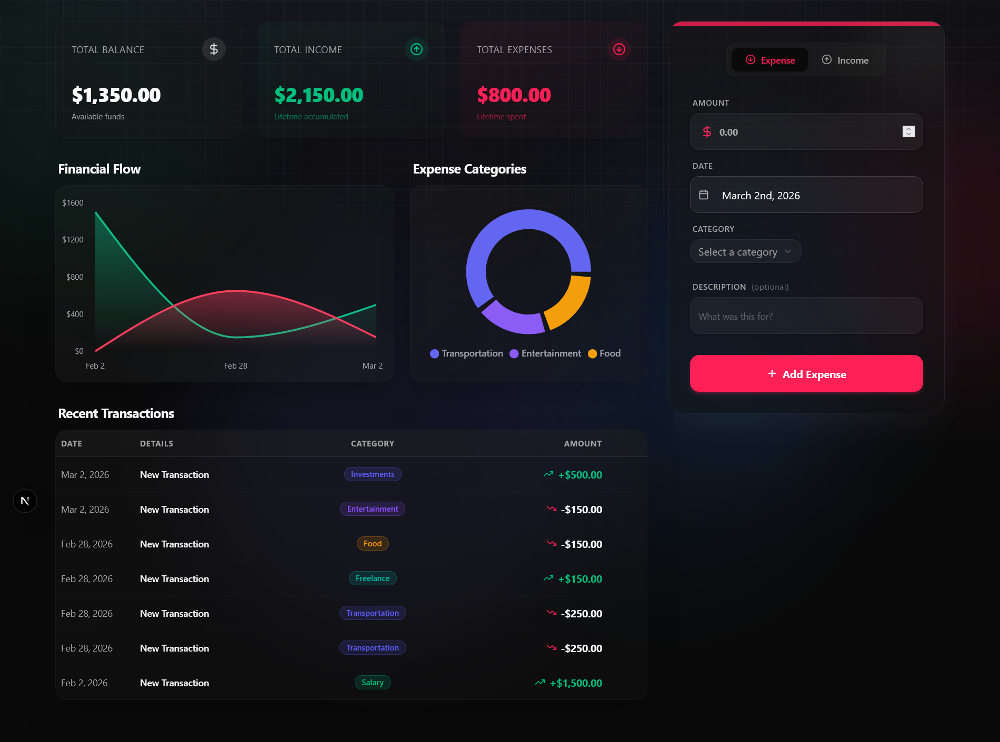

# Finance Tracker



Finance Tracker is a modern, feature-rich personal finance management application built with Next.js and Supabase. It features a stunning dark-mode UI with glassmorphism and animated Aurora background effects.

## 🚀 Features

- **Modern Tech Stack**: Built with React 19 and Next.js 16 (App Router).
- **Authentication & Database**: Powered by [Supabase](https://supabase.com) (Auth and PostgreSQL database).
- **Beautiful UI**: Designed with [Tailwind CSS v4](https://tailwindcss.com/) and [Shadcn UI](https://ui.shadcn.com/) components.
- **Interactive Charts**: Data visualization using [Recharts](https://recharts.org/).
- **Premium Aesthetics**: Glassmorphism design system, atmospheric background decorators, and smooth animations.

## 🛠️ Built With

- **Framework**: Next.js 16
- **UI & Styling**: Tailwind CSS, Radix UI, Shadcn UI, Lucide Icons
- **Backend & Auth**: Supabase
- **Data Visualization**: Recharts
- **Date Utilities**: date-fns

## 🏗️ Getting Started

### Prerequisites

Ensure you have Node.js and `npm` installed.

### Installation

1. Clone the repository:

   ```bash
   git clone <repository-url>
   cd finance-tracker
   ```

2. Install dependencies:

   ```bash
   npm install
   ```

3. Set up environment variables:
   Create a `.env.local` file in the root directory and add your Supabase credentials:

   ```env
   NEXT_PUBLIC_SUPABASE_URL=your_supabase_project_url
   NEXT_PUBLIC_SUPABASE_ANON_KEY=your_supabase_anon_key
   ```

4. Run the development server:

   ```bash
   npm run dev
   ```

5. Open [http://localhost:3000](http://localhost:3000) with your browser to see the result.

## 🎨 UI/UX Highlights

- Dynamic background with glowing orbs and grids for a futuristic feel.
- Fully responsive dark-mode-first styling.
- Highly accessible components built on top of Radix UI.
